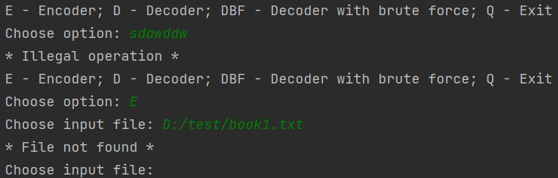

##**Cryptoanalyzer**
___

###Short description
Program for encoding/decoding text information with Caesar’s encryption.
The program works in three modes:
- encryption by key;
- decryption by key;
- deciphering by brute force.

Project launch:

`C:\>java -Dfile.encoding=UTF-8 -Dconsole.encoding=UTF-8 -jar cryptoanalyzer.jar`

The executable `cryptoanalyzer.jar` file is located in the `dis` project directory.
___
###Restrictions
The program works with .txt format files. With texts written in Cyrillic.
___
###Description of encryption/decryption algorithm
A substitution cipher is used, in which each character in open text is replaced by a symbol that is on a fixed number 
of positions to the left or to the right of the character in the alphabet.
___
###Description of classes
The root package of the `ua.com.javarush.cryptoanalyzer` project contains the `Main` class containing an application 
start point.

The package `consoleui` contains the class:
- `ConsoleMenu` - dialogue menu for user to work with console. The class has methods for initializing the class fields with
data that the user has entered through the menu.

The package `constants` contains the classes:
- `ConsoleOption` - list of constant-options to work with the application menu.
- `ConsoleMessage` - list of constant-messages to the user via the console.
- `Alphabet` - class contains alphabet of Cyrillic symbols and some special characters.

The package `cryptography` contains the classes:
- `Encoder` - encrypting text information from a file, with encryption key. Create encrypted file.
- `Decoder` - decryption of text information from a file, with encryption key. Create decrypted file.
- `BruteForceDecoder` - Decryption of the text information from a file by comparing the most common character in encrypted 
text with the symbol ' '(as the most distributed character in the texts). Calculate the possible encryption key by 
calculating the difference between the position of the encoded symbol in the alphabet and the position of the symbol 
' '. The computed encryption key, with the paths to the input and output files, are passed to the Decoder class.
___
###Description of the program interface.

The user interacts with the application via the console menu. Depending on the type of operation selected, the user 
enters the path to the input . txt file. Enters the path to the directory where the output file will be created. 
Specifies the name for the output file. Enters the encryption key if the appropriate option was previously selected.
After executing the business logic of the program, the console displays information about the type of the completed 
process and the path to the output file with the result.

Example of entering input data and displaying information about the result of the program:

At all stages of the program, if the user enters incorrect data, the application informs him of this.

___
###Results of the program. Tests and examples.
Encryption (key: 23)

Input file:

Output file:

Testing decryption with brute force.

Three books by three different authors were taken for the test(so that the writing styles were as different as 
possible). All three books were encrypted with different keys. And all three books were successfully decrypted by the 
brute force algorithm.